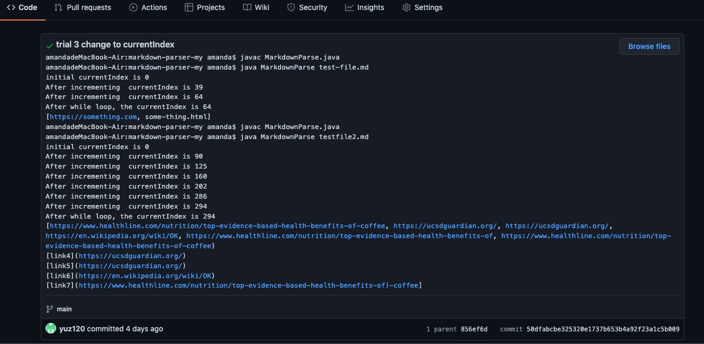
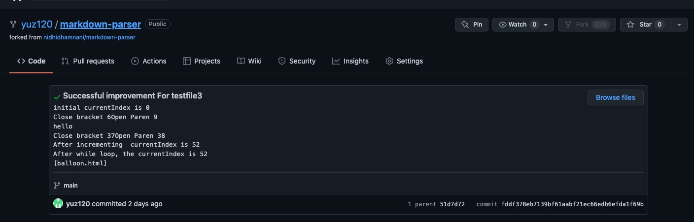
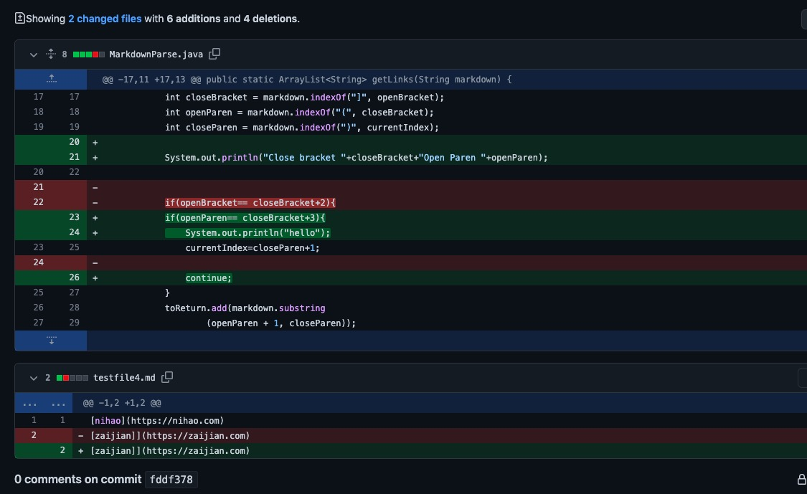
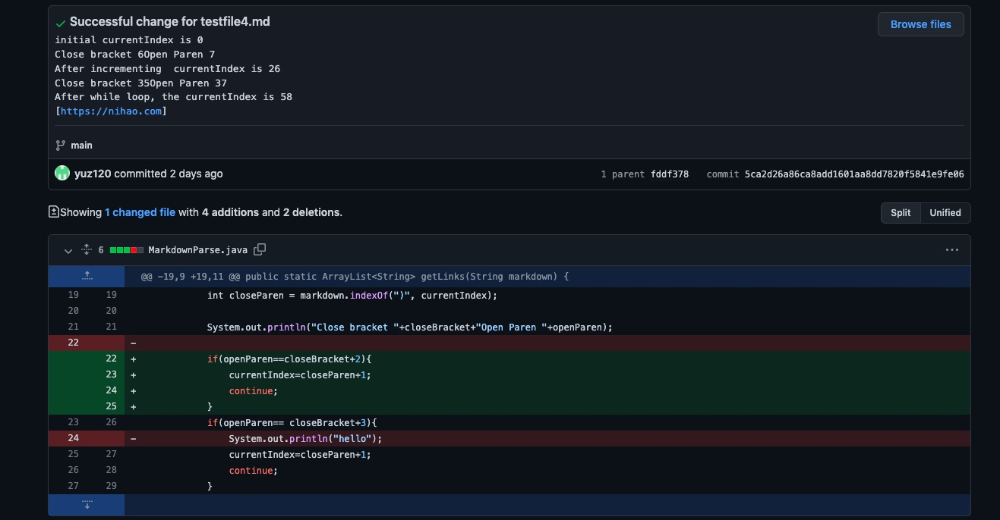
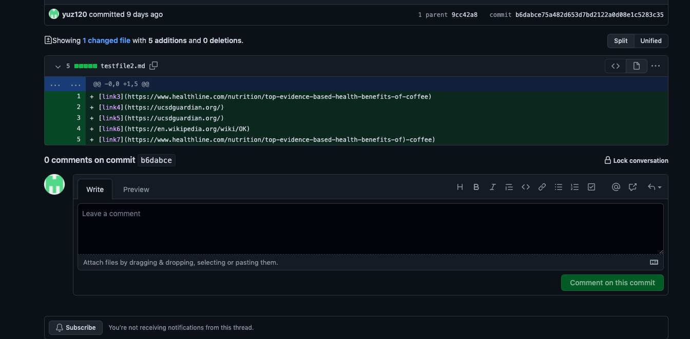
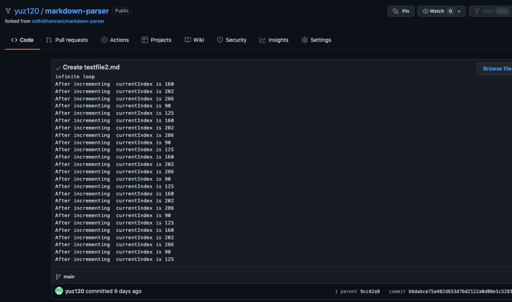
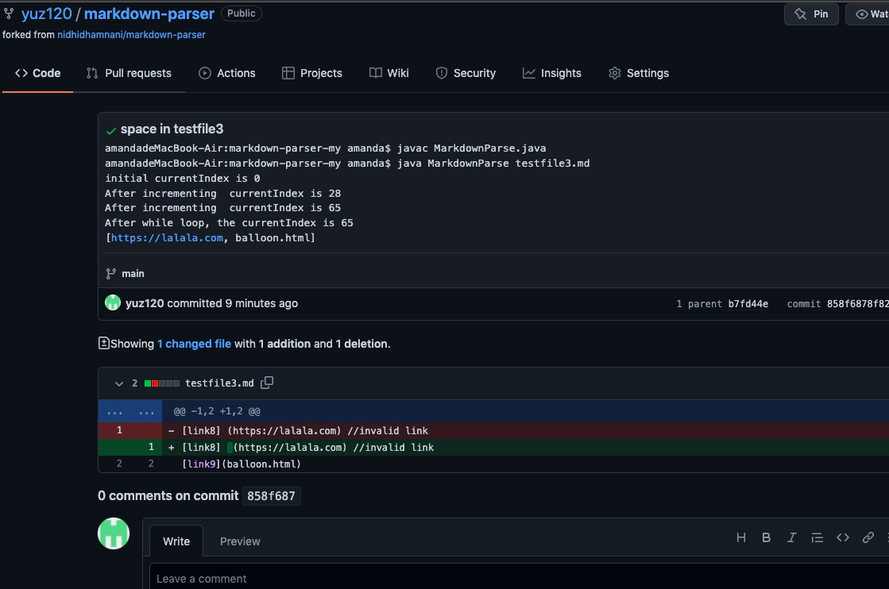
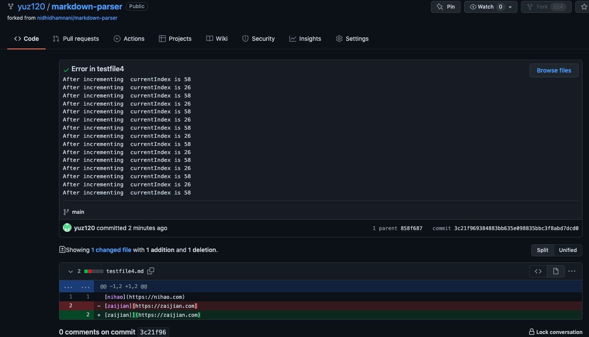

# Lab Report 2 - Week4
Yuyang Zhou
April 24, 2022

## Part 1. Screenshots
* improvement for testfile2.md

* improvement for testfile3.md

* improvement for testfile4.jpeg

[testfile2](https://github.com/yuz120/markdown-parser/blob/6560bc3cfa2d9c111c5cb5e74df3ef891f0219e7/testfile2.md)
[testfile3](https://github.com/yuz120/markdown-parser/blob/6560bc3cfa2d9c111c5cb5e74df3ef891f0219e7/testfile3.md)
[testfile4](https://github.com/yuz120/markdown-parser/blob/b7fd44e74ac1d24a87b5e37131eafb75fe95898a/testfile4.md)

## Part 2. Symptom and Failure-Inducing Input
> In general, symptom is unexpected behavoir of the code. Bug is a flaw in the computer system, which could induce zero or more symptoms. Failure-inducing input is the input that executes the bug and make symptoms appear. (Source: [Regehr's blog](https://blog.regehr.org/archives/199))
* testfile2.jpeg

    * Bug: Cannot exit while loop
    * Symptom: infinite loop
    * Failure-inducing input: extra closing parenthesis in the website link
* testfile3.jpeg

    * Bug: 
    * Symptom: Include an invalid link
    * Failure-inducing input: an extra space after the closing bracket
* testfile4.jpeg

    * Bug: 
    * Symptom: infinite loop
    * Failure-inducing input: extra closing bracket after the closing bracket

