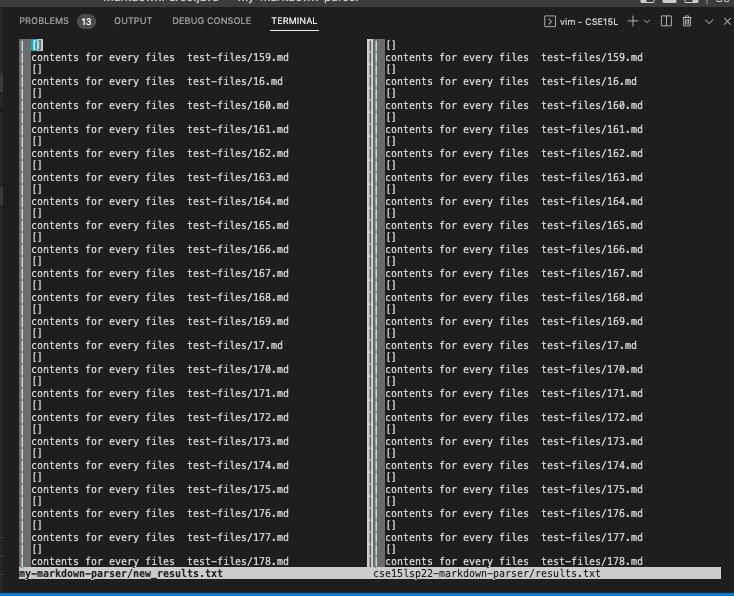

# Lab Report 5 Week 10
Yuyang Zhou
2022.06.10

## Part 1, MarkdownParsers & tests
* `make test`

* I used `git clone` command to clone my markdownparser into my-markdown-parser folder, and the provided one is in cse15lsp22-markdown-parser folder. 

* `cp -r cse15lsp22-markdown-parser/test-files my-markdown-parser/` The command copies all the test files from the given markdownparser into my own. (Copy recursively) 
* I used `time bash script.sh > results.txt` for the given repository, saving the bash output into results.txt.
* Likewise, `time bash script.sh > new_results.txt` for my repository, saving into new_results.txt.
## Part2 Compare the two implementations
* `$ vimdiff my-markdown-parser/new_results.txt cse15lsp22-markdown-parser/results.txt` Using vimdiff to show the paralleled differences in two files with bash results
* 
* The results are exactly the same. Vimdiff shows all in white color, which suggests there are no differences.
* I also searched manually and checked there the printed output are the same for the two.
* Thus, I chose two random tests: 20 and 171. 
The results: 
for 20.md

The link to 20.md:
[link to 20.md](https://github.com/yuz120/markdown-parser/blob/292a8d15704f95841ccb7c7f3147d80f8b30928c/test-files/20.md)
Both the given MarkdownParse and my MarkdownParse did not print out the link. It is correct since there are no brackets and parenthesis. Codes of the two MarkdownParse files only detect the index of open and closed brackets and parenthesis.

for 483.md

