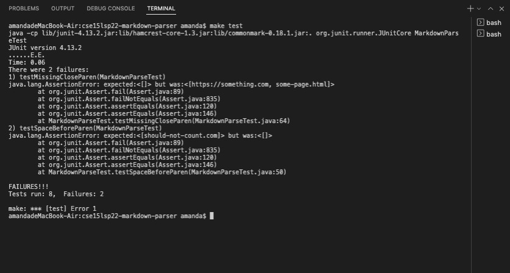
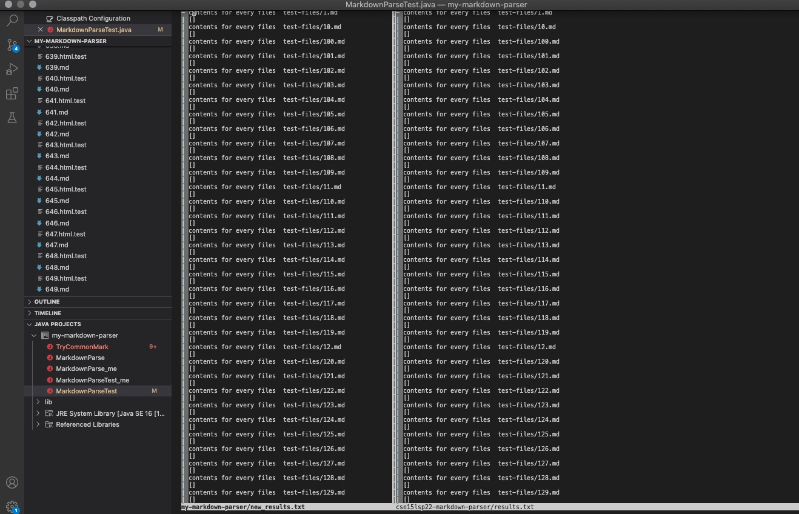
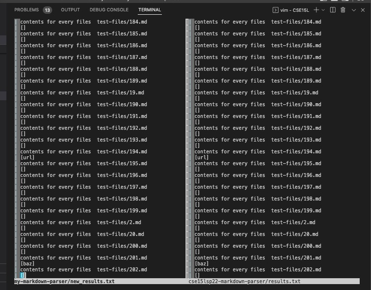
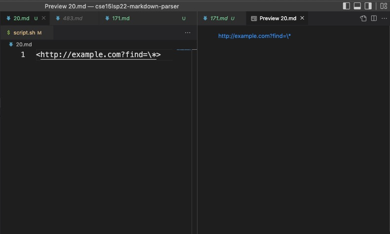
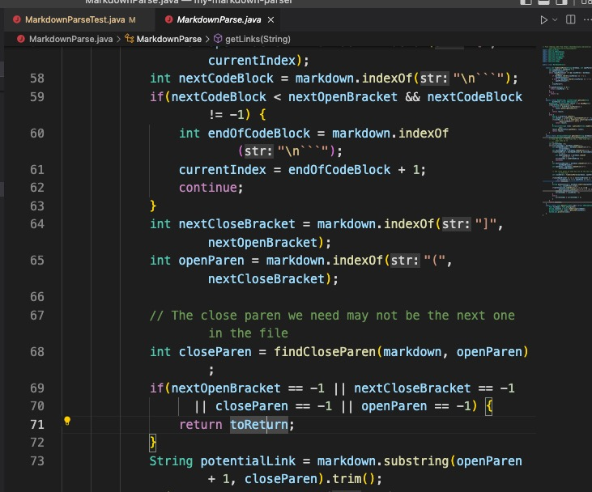
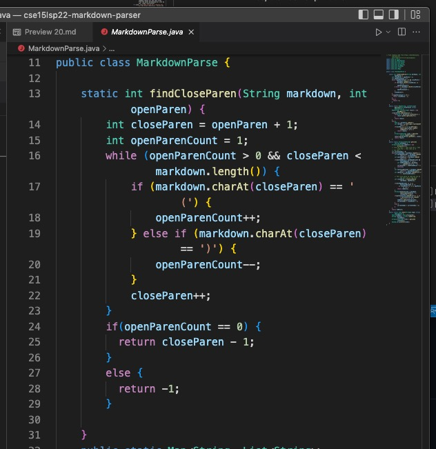
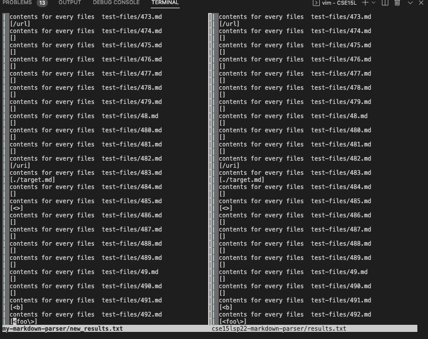
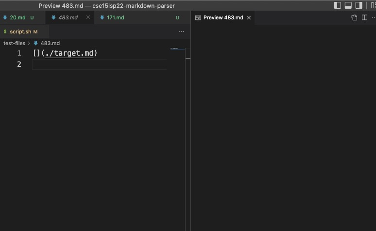
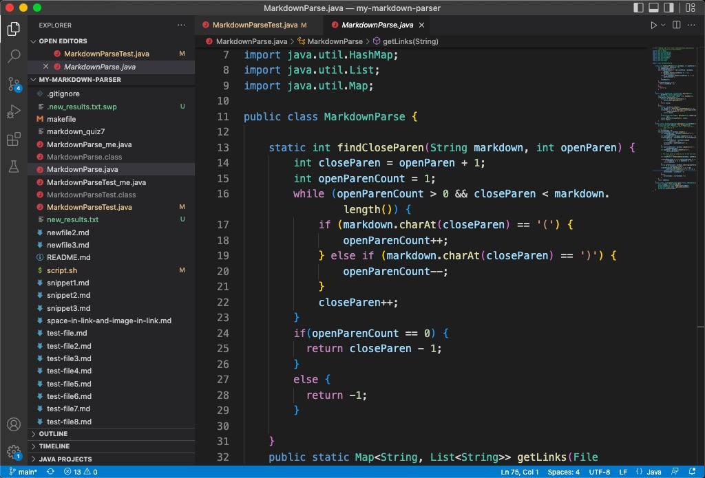
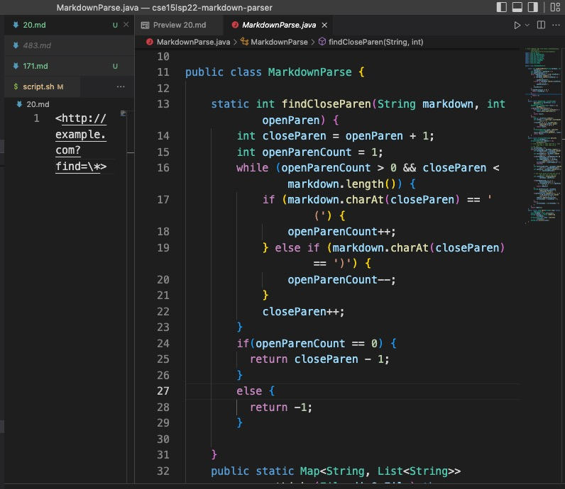

# Lab Report 5 Week 10
Yuyang Zhou
2022.06.10

## Part 1, MarkdownParsers & tests
* `make test`

* I used `git clone` command to clone my markdownparser into my-markdown-parser folder, and the provided one is in cse15lsp22-markdown-parser folder. 

* `cp -r cse15lsp22-markdown-parser/test-files my-markdown-parser/` The command copies all the test files from the given markdownparser into my own. (Copy recursively) 
* I used `time bash script.sh > results.txt` for the given repository, saving the bash output into results.txt.
* Likewise, `time bash script.sh > new_results.txt` for my repository, saving into new_results.txt.
## Part2 Compare the two implementations
* `$ vimdiff my-markdown-parser/new_results.txt cse15lsp22-markdown-parser/results.txt` Using vimdiff to show the paralleled differences in two files with bash results
* 
* The results are exactly the same. Vimdiff shows all in white color, which suggests there are no differences.
* I also searched manually and checked there the printed output are the same for the two.
* Thus, I chose two random tests: 20 and 483. 
The results: 
for 20.md

The link to 20.md:
[link to 20.md](https://github.com/yuz120/markdown-parser/blob/292a8d15704f95841ccb7c7f3147d80f8b30928c/test-files/20.md)
* VS Code preview of 20.md

* 

* expected : print out the link
* Both the given MarkdownParse and my MarkdownParse did not print out the link. The reason is that the codes of the two MarkdownParse files only detect the index of open and closed brackets and parenthesis.
* Solution: add the check for "<>", using if statement 
        if (index of open bracket =-1 && open parenthesis =-1){
            let "<" be index 0,
            ">" be the last index. Then print out the link within "<" and ">". 
        }
### In my repository,
    
    * Add to line 72. 

### In the given repository,
    
    Add the same if statement at Line 30.

* for 483.md

The link to 483.md:
[link to 483.md](https://github.com/yuz120/markdown-parser/blob/292a8d15704f95841ccb7c7f3147d80f8b30928c/test-files/483.md)

* expected output: print out nothing
* Preview: 

* actual: print out the link 
* Both MarkdownParse print out the link. Because both detect the pair of parenthesis and the other pair of brackets. However, the brackets contain nothing. It means there is no name of the website. The format of the link is not complete.
* The way to address:
    * Add an if statement to check if the index of closing bracket is index of open bracket+1.
    * If so, then do not print the link.

* In my repository,

Add the above if statement to between lines 25 and 26.

* In the given repository,

Add the above check to between Lines 23 and 24

    

