## **Week 2 Lab Report**
                            Yuyang Zhou
                            April 10, 2022

### *Part 1*
### Install Visual Studio Code
* Go to website [Visual Studio Code](https://code.visualstudio.com/)
* Download the app and open it

 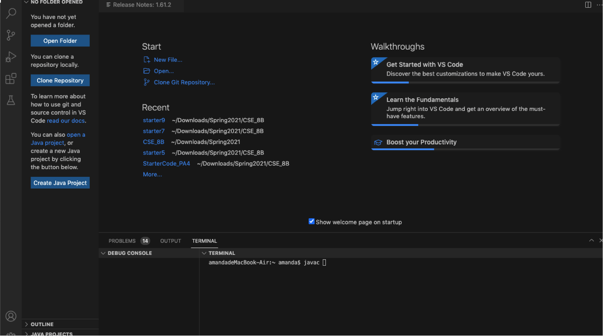
 * This is the first page when opening Visual Studio Code for the first time.

### *Part 2*
### Remotely Connecting
* Check the CSE15L account on [website](https://sdacs.ucsd.edu/~icc/index.php). 
* It looks like this.
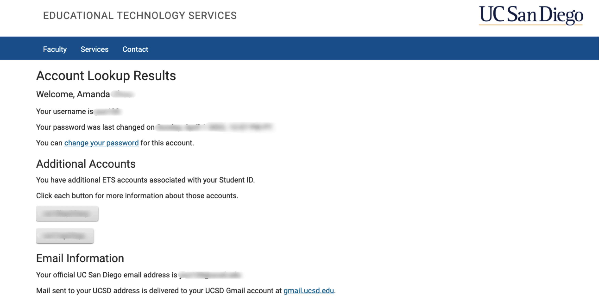
* Look at the "Additional Accounts".
* Your account name should be `$ ssh cs15lsp22zz@ieng6.ucsd.edu`, with `"zz"` replaced by your own letters.
* Open the terminal in Visual Studio Code. Type the command 
        `$ ssh cs15lsp22zz@ieng6.ucsd.edu`
After that, the terminal should look like this:
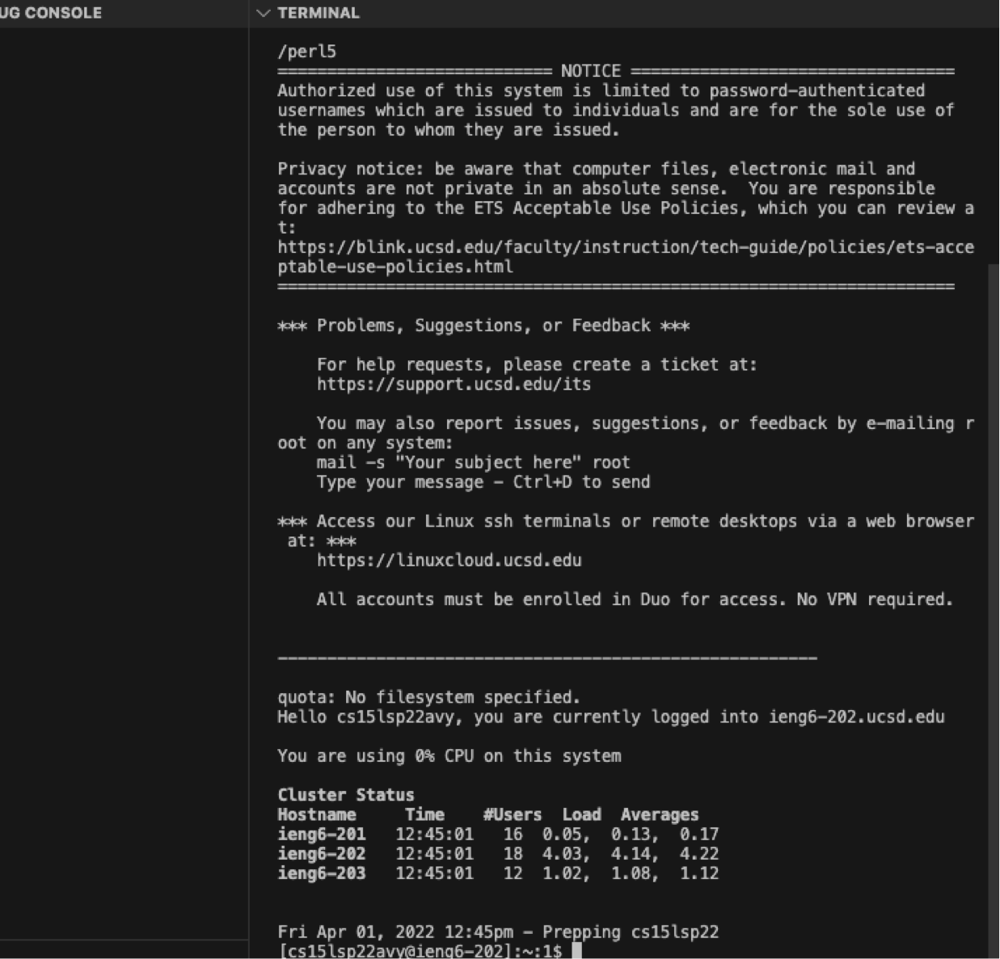
* Now, the computer(the client) is successfully connected to the server.

### *Part 3*
### Trying Some Command
* Run some commands by yourself. Compare the output using commands with and without `ssh`.
    * `cd` 
    * `cd ~`
    * `ls -lat`
    * `ls -a`
    * `pwd`
    * `cp`
    * `...`

Without `ssp`:
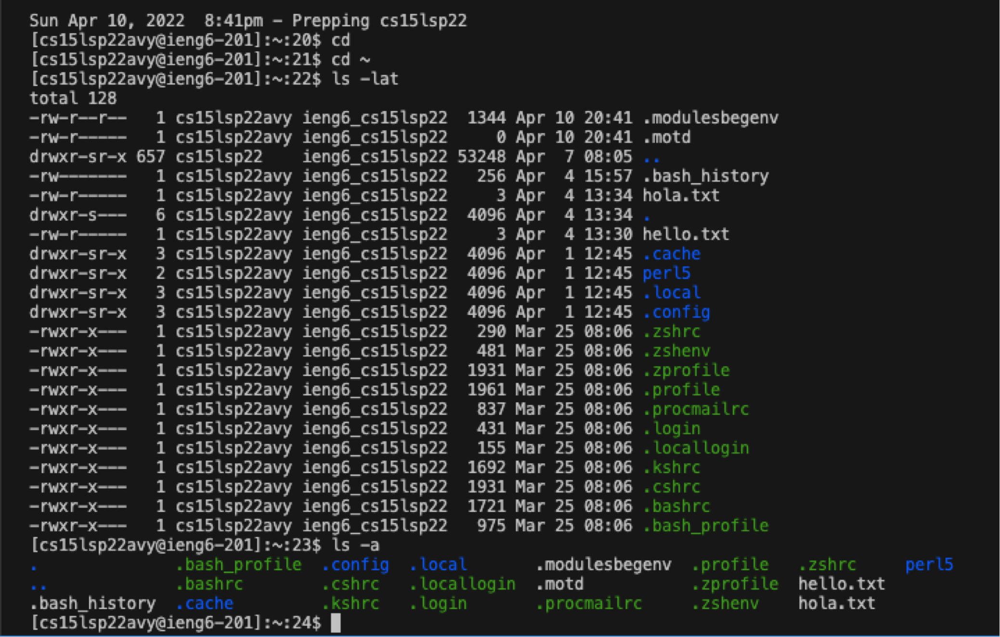

With `ssp`:
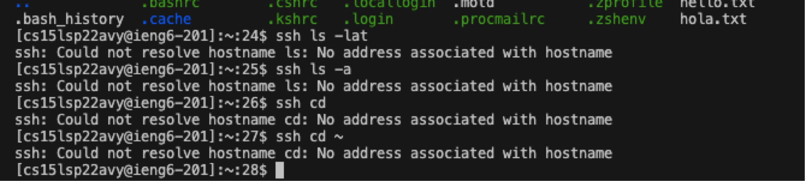

There is the errors of no access to the files, because you need to type `$ssh` instead of `ssh`.

>Let's try again.
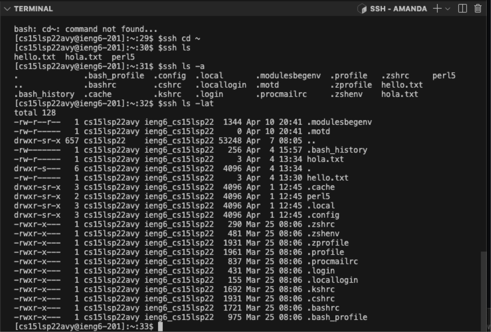
This time the commands work.

### *Part 4*
### Moving Files with scp
* Copy a file from your computer to a remote computer.
* Using the command `scp`
* Create a file called `WhereAmI.java`, and put contents as the picture shows:
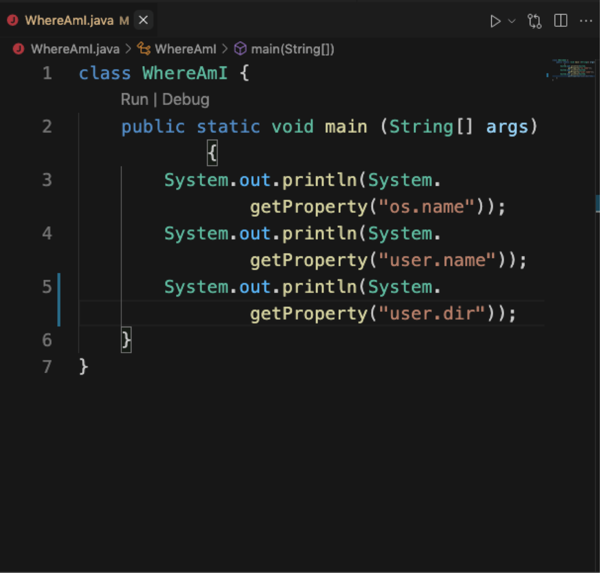

* Run `java` and `javac` to see the outputs. It is the process to compile the file.

The output:
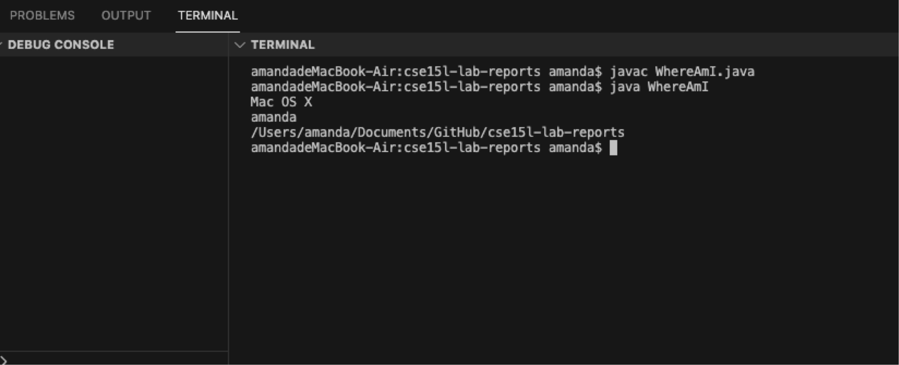

* Then type `scp WhereAmI.java cs15lsp22zz@ieng6.ucsd.edu:~/` 
    (`scp` means "secure copy")

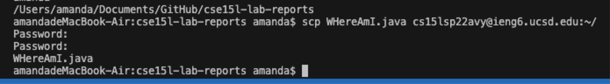

* Log into ieng6 with `ssh`, type `ls`. The file should be in your home directory.
`

`
* Now try to compile in `@ieng6`
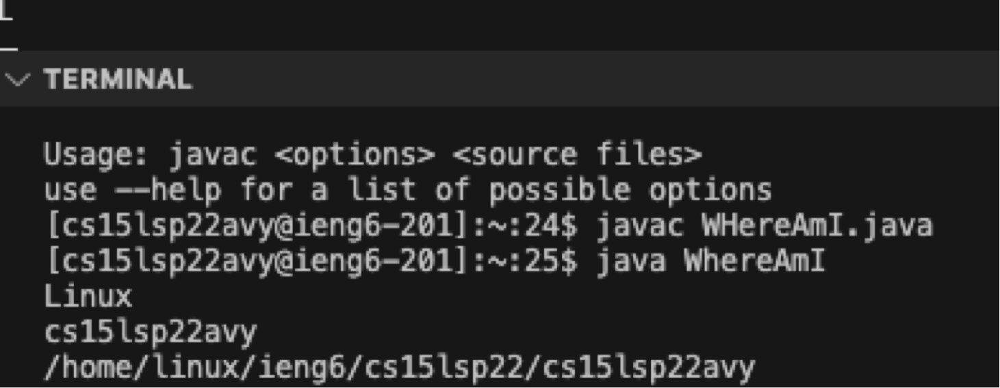

    (Note: here is a typo of the file name `WHereAmI`: "H" should be in lowercase.)
   
### *Part 5*
### Setting an SSH Key
* type `ssh-keygen` and other commands, with output as shown in the picture:
* Remember not to add a `passphrase`.
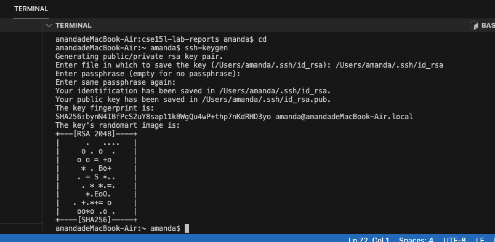
    * Tip 1: Start from Home directory of your own computer (use command `cd`)
    * Tip 2: When copying the`(/Users/<user-name>/.ssh/id_rsa)`, remember to change the user-name.

* use commands:
* `$ ssh cs15lsp22zz@ieng6.ucsd.edu`
* `<Enter Password>`
* `$ mkdir .ssh`, make a directory called ssh
* `$ <logout>` , You may use `control` + `D` buttons
* `$ scp /Users/<user-name>/.ssh/id_rsa.pub cs15lsp22zz@ieng6.ucsd.edu:~/.ssh/authorized_keys`,  make a secure copy of authorized keys from the local to the remote directory.
* 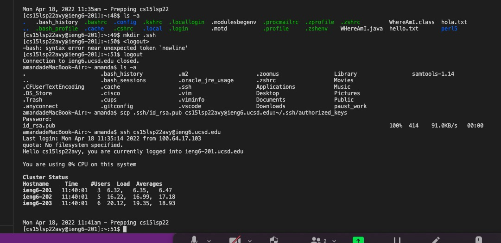

### *Part 6*
### Optimizing Remote Running
* Use `ssh cs15lsp22zz@ieng6.ucsd.edu "ls"` command

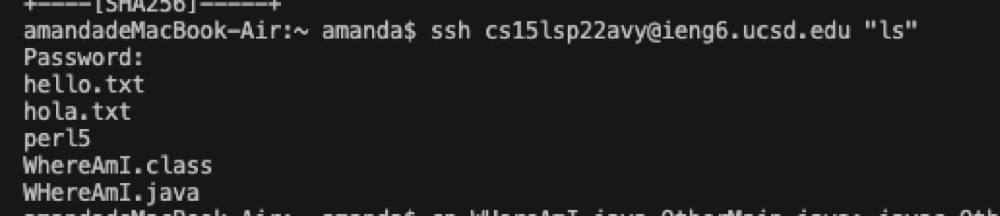
* Make a local edit to WhereAmI.java file, and copy the file to the remote server and run it.
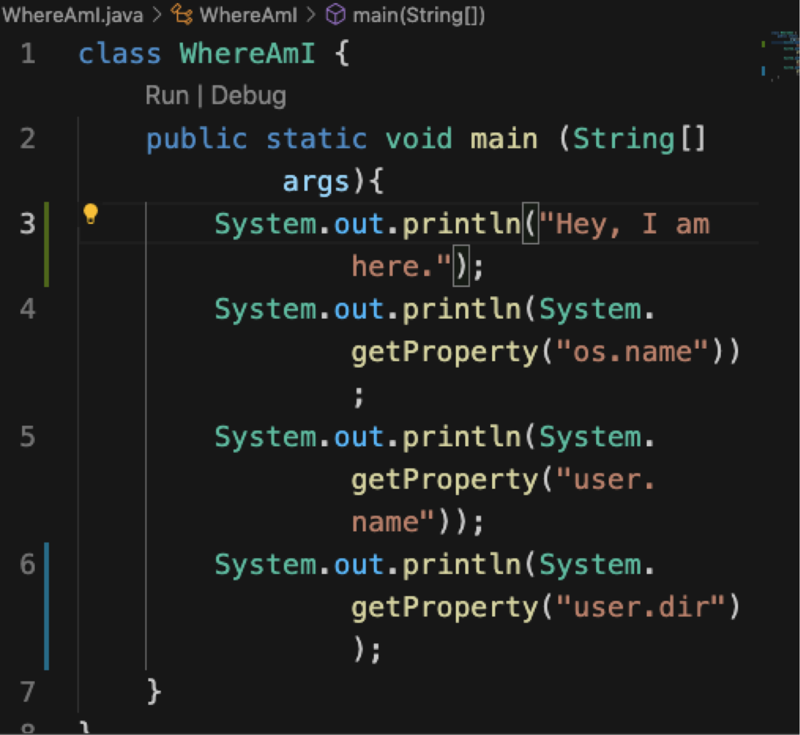
The outcome after running `ssh cs15lsp22zz@ieng6.ucsd.edu "ls"` again is shown in the picture.

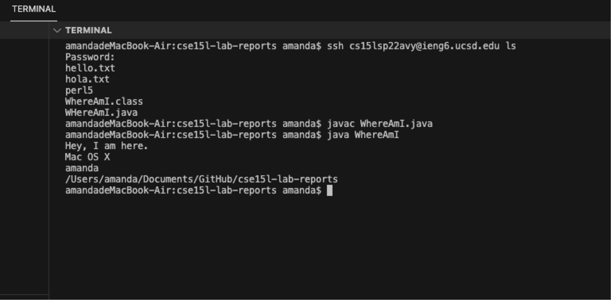

  * Note: I don't feel I have optimized the process to a satisfying extent. I wonder if there are any better methods. Please keep exploring.

