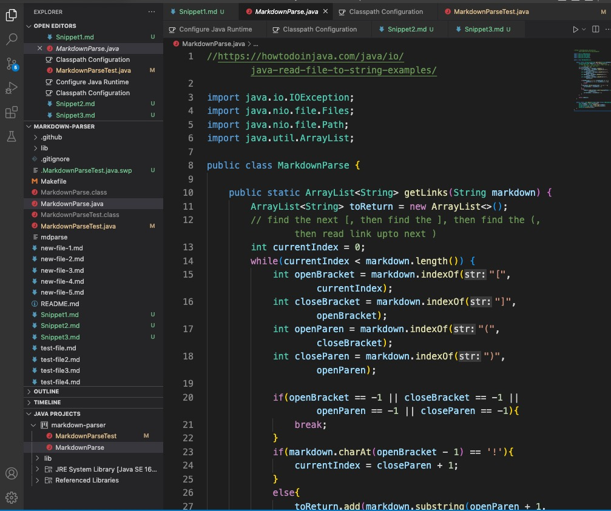
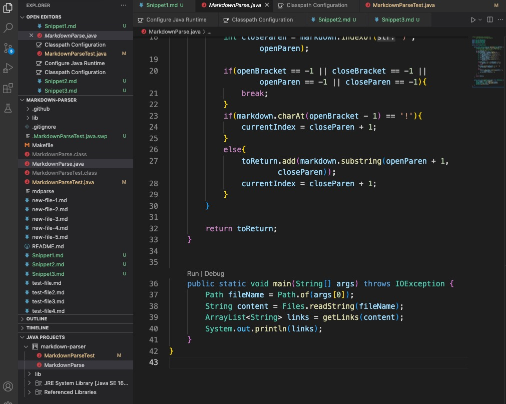
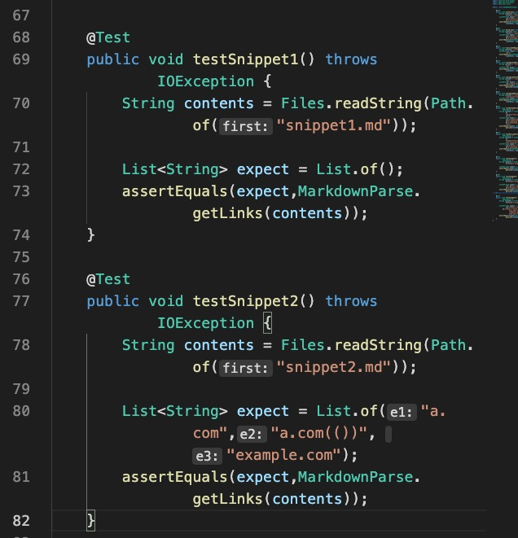
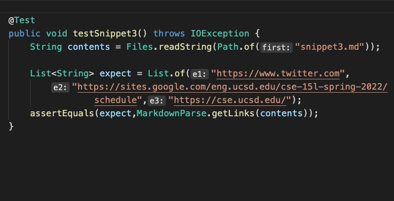
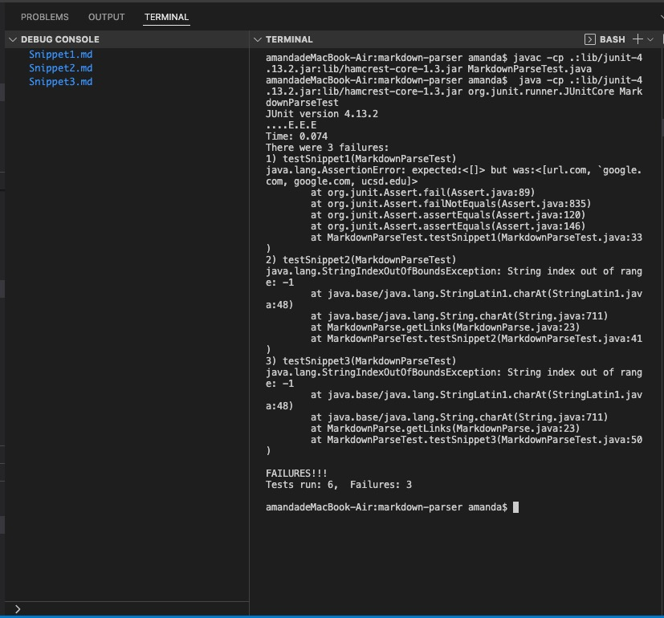
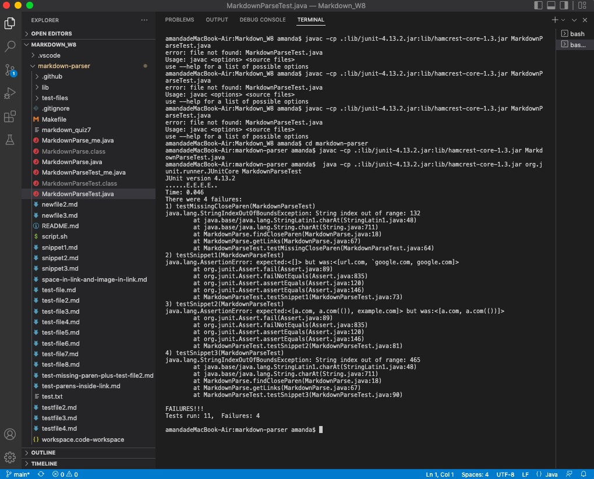

# Week 8 Lab Report 4
    Yuyang Zhou
    2022.05.22

## Part 1 Tests for the markdownParse for review
* [The link to the repository](https://github.com/jina-leemon/markdown-parser.git)

* Whereas the other group has updated the files in their repository, I sticked to the original version of their repository (which I have cloned to the local computer 2 weeks ago.)
* Their MarkdownParse.java looks like this:

* I added three test files and three testers in MarkdownParseTest.java according to the snippets.
* Snippet 1

* Snippet 2

* Snippet 3

* The first and second testers

* The third tester

* Snippet 1 : expect to be no links
    *  Because there are backsticks in between brackets and parenthesis on each lines, also there is an extra opening bracket on line 3 and an extra closing bracket on line 4. 
* Snippet 2: expect three links
*  "a.com","a.com(())", "example.com"
    * The nested link has complete markdown structure on line 1
    * On line 2, although a.com(())is not an actual link, the structure is correct (with a pair of brackets and a pair of parenthesis)
    * on line 3, the example.com is a valid link also because the structure is complete.
* Snippet 3: expect three links.
* "https://www.twitter.com", "https://sites.google.com/eng.ucsd.edu/cse-15l-spring-2022/schedule", "https://cse.ucsd.edu/"   

    * Although there are line breaks in between the brackets and extra-long sentences, the structure of a pair of brackets and a pair of parenthesis is complete. Thus, I think the three links are all valid and should be printed out.

* As I run the testers, at first, the paths are not found. It is because I used the VSCode play button to run the tests.
* Then I used the terminal to run the tests.

* The above is the output of running the tests on the snippets.

### Why didn't the program pass the tests? (The bugs in the repository under review)

* For snippet 1:
    * The markdownParse under review does not check if backsticks exist in between the brackets.
    * It does not check the extra opening bracket in between the brackets.
    * As long as there is a pair of brackets and a pair of parenthesis, the links will be detected, including the invalid links.
* For snippet 2:
    * The output turns out index out of bound. The cause is on line 23 in MarkdownParse.java. Since openBracket is equals to 0 (at the first index in snippet 2), when there is no "!" before the the open bracket, 0-1=-1, which is out of bounds. 
    * The way to debug could be adding a check. 
        * If (markdown.charAt(openBracket==0){
            //don't minus one
        } 
* For snippet 3:
    * The output is index out of bound. The bug is on line 23 in MarkdownParse.java, which is the same as for snippet 2. It is because openBracket is at index 0; when it minus 1, index=-1 which is out of bounds.
    * I recommend deleting the if statement from line 23 to 25.

## Part 2 Tests for markdownParse in my repository.
* [The link to the repository](https://github.com/yuz120/markdown-parser.git)
* The testers are the same as those in Part 1. 
* All the testers for snippets did not pass.

### Why didn't the program pass the tests? (The bugs in my group's repository)
* For snippet 1
    * The reason is similar with that of the repository under review. It does not check if backsticks exist in between the brackets or the extra opening bracket
   
* For snippet 2
    * The test successfully returns two links.
    * From line 67-79 in MarkdownParse.java, they help to track open parens and matching close parens.
    * It did not pass the test because the code did not handle the hidden brackets in between the paired brackets.
* For snippet 3
    * The output is index out of bounds. 
    * The bug is on line 18 in MarkdownParse.java. closeParen is out of bounds, since the test did not handle the line breaks and extra-long lines.

### Answer the questions:
1. Yes, I think there is a small code change (<10 lines) that will make your program work for snippet 1 and all related cases that use inline code with backticks. Add an if statement to check the backticks using indexing and then compare those with the open and close brackets. In this way, the code can detect the backticks and reduce the effects on reading the links.
2. Yes, I think there is a small code change (<10 lines) that will make my program work for snippet 2 and all related cases that that nest parentheses, brackets, and escaped brackets. The code change may be between 67-79, adding a check on hidden brackets. It could track the index of opening and closing brackets. If they are within the bound of the existed pair of brackets, then "omit" the extra ones. 
3. No, I don't think there is a small code change(<10 lines) that will make my program work for snippet 3 and all related cases that have newlines in brackets and parentheses. Because the code in MarkdownParse.java are mainly using indexing, whose efficiency is hugely affected by the newlines and extra-long sentences. I think the newlines should be handled throughout the MarkdownParse so that the close paren could be in bounds.

