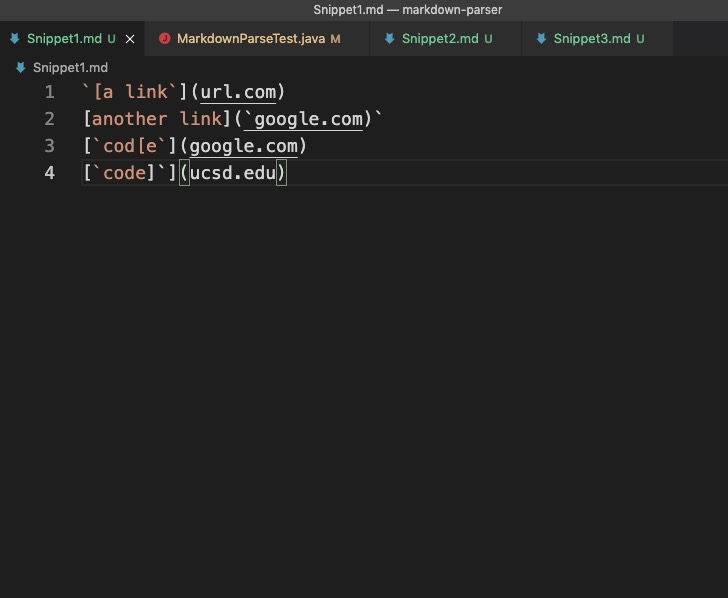
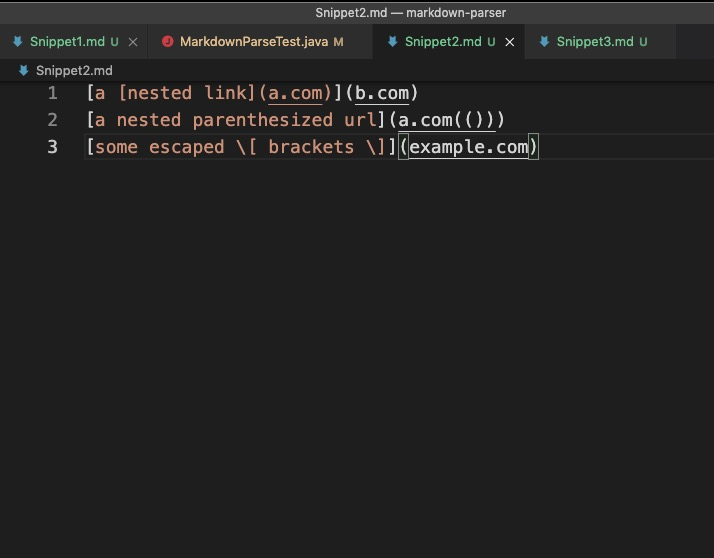
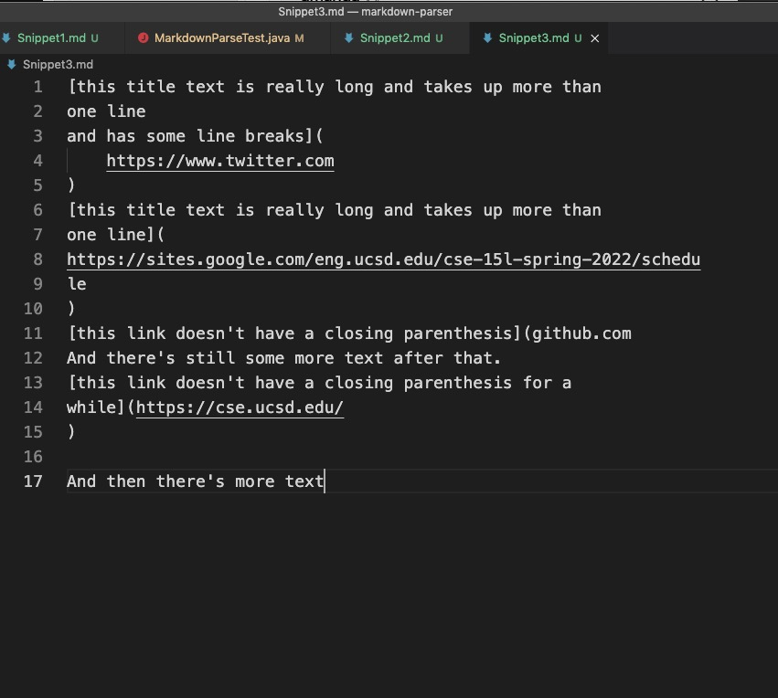
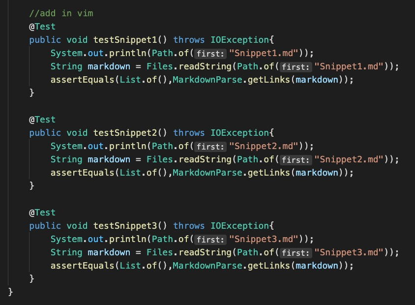

## Week 8 Lab Report 4
    Yuyang Zhou
    2022.05.22

### Part 1 Tests for the markdownParse for review
* [The link to the repository](https://github.com/jina-leemon/markdown-parser.git)

* I added three test files and three testers in MarkdownParseTest.java according to the snippets.
* Snippet 1

* Snippet 2

* Snippet 3

* Inside the MarkdownParseTest.java

* As I run the testers, at first, the paths are not found. It is because I used the VSCode play button to run the tests.
* Then I used the terminal to run the tests.
* The first tester

* The second tester

* The third tester

### Part 2 Tests for markdownParse in my repository.
* [The link to the repository](https://github.com/yuz120/markdown-parser.git)
* All the testers for snippets did not pass.

