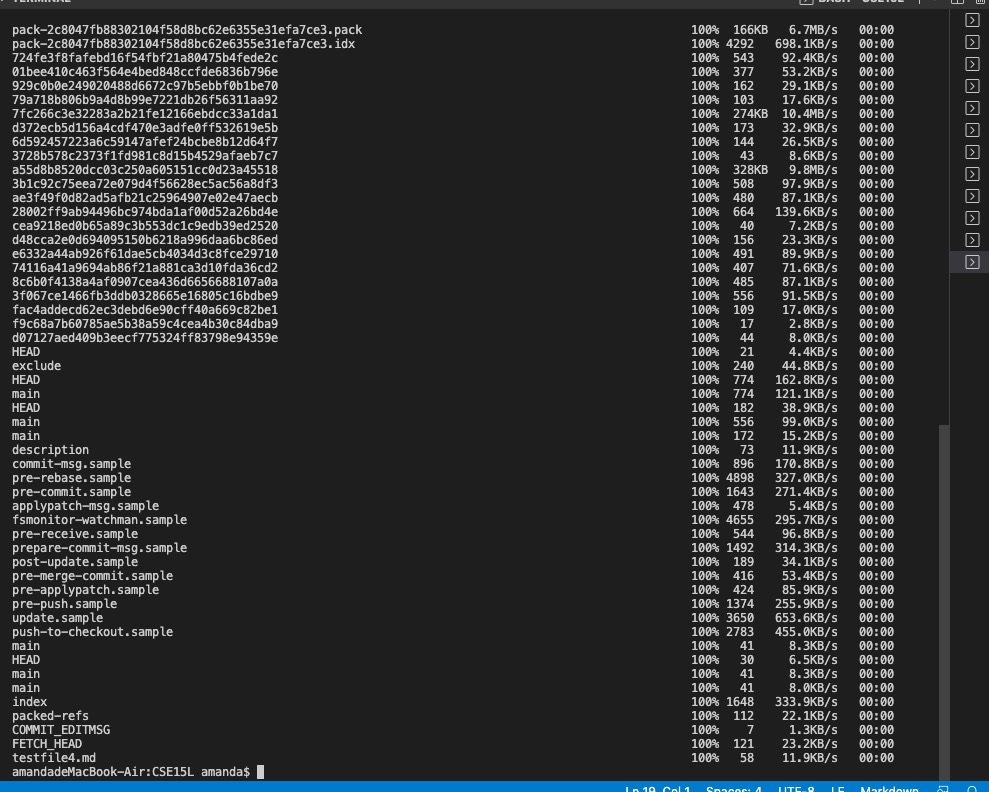

## Lab Report 3 Week 6

Yuyang Zhou
2022.05.08

### I. Part One
### Streamlining ssh Configuration
* 

* Before, I need to type the complete command `$ ssh cs15lsp22zzz@ieng6.ucsd.edu `.It is quite long. Streamlining ssh configuration could make the command shorter and more convenient to type. First, use command `touch config` to create an empty config file. Then use command `vim config` to add and edit content into the config file. Enter `i` to insert words. 

* The config file content looks like this：
* 

* Enter `:q` and press `Enter`.

* 

### II. Part Two
### Setup Github Access from ieng6
* 
* The content of the Config file:
* 

* 

* Push a change to Github:
* I added a comment for the addition test.
* 
* No 

### III. Part Three
### Copy whole directories with scp -r

* Compiling and running tests in the remote repository in ieng6

