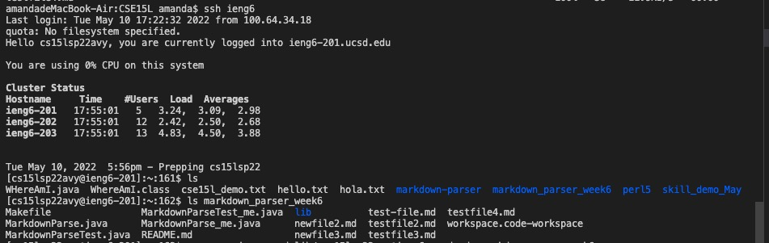

## Lab Report 3 Week 6

Yuyang Zhou
2022.05.08

### I. Part One
### Streamlining ssh Configuration
* 

* Before, I need to type the complete command `$ ssh cs15lsp22zzz@ieng6.ucsd.edu `.It is quite long. Streamlining ssh configuration could make the command shorter and more convenient to type. First, use command `touch config` to create an empty config file. Then use command `vim config` to add and edit content into the config file. Enter `i` to insert words as followings. 

    `Host ieng6`
    `HostName ieng6.ucsd.edu`
    `User cs15lsp22avy`
    `IdentityFile ~/.ssh/id_rsa`

* The config file content looks like this：
* 
* Enter `:q` and press `Enter`.

 
* Type `ssh ieng6` command and log in to the remote ssh account. 

### II. Part Two
### Setup Github Access from ieng6
* Use command `ssh-keygen` tog enerate the public/private key pair in local computer
* Then, the public key is in id_rsa_github.pub
* Use command `cd .ssh`  to log in ssh repository in the local computer. 
* Using `ls` to list files in ssh repository. There should be a file named id_rsa_pub
* Use command `cat id_rsa_pub` (cat means "concatenate") to read data from the file and give the content of id_rsa_pub as output 

* 

* Paste the link into the github repository yuz120 through the button "SSH and GPG keys". The new SSH key is shown as below:

* 

* Push a change to Github:
* I added a comment for the addition test.
* 
* Commit the change to github repository
* 

* The link to the commit:
* [Add a comment message](https://github.com/yuz120/markdown-parser/commit/a30bca5ab42f040645f0f9daa2bd8673271e75fa)
Since there are no repositories with the same name in Github (markdown_parser_week6), it may be the reason why the change does not show up.However, it is commited to remote repository in ssh account.

### III. Part Three
### Copy whole directories with scp -r
* Using `scp` command to manually copy the entire directories of files to remote directory is not helpful, since it is error-prone
* However, copying recursively addresses this issue.
*  Use the command `cd` to change the directory to markdown-parser-week6 repository in the local computer.
* `pwd` print the path of current working directory
* `scp -r markdown_parser_week6 ieng6:./` The command is used to recursively copy the files in markdown_parser_week6 to ieng6 account.
 

* Then log into `ssh ieng6` again.

* `ls` list files in the remote account, there should be a repository called markdown_parser_week6. 

* Compiling and running tests in the remote repository in ieng6

* I have removed the repository and its files recursively through `rm -rf markdown_parser_week6` command

* Try another way to copy the repository recursively to remote account ieng6, using the command 
`scp -r markdown_parser_week6 ieng6:./;ssh ieng6;ls;cd markdown_parser_week6;javac -cp .:lib/junit-4.12.jar:lib/hamcrest-core-1.3.jar MarkdownParseTest.java;java -cp .:lib/junit-4.12.jar:lib/hamcrest-core-1.3.jar org.junit.runner.JUnitCore MarkdownParseTest`
* Using semicolon to seperate each command, they together serves as a shortcut that streamlines the process of secure copying, logging into ieng6 account, changing directory into markdown_parser_week6 repository and running the junit tests.

