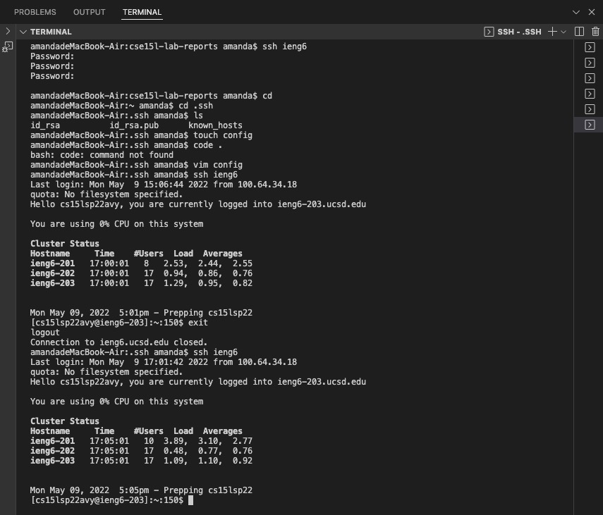
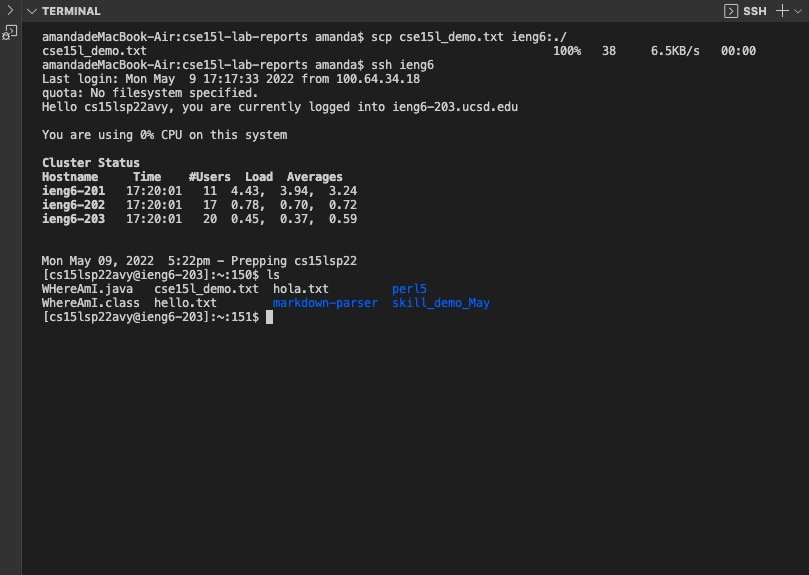

## Lab Report 3 Week 6

Yuyang Zhou
2022.05.08

### I. Part One
### Streamlining ssh Configuration
* 

* Before, I need to type the complete command `$ ssh cs15lsp22zzz@ieng6.ucsd.edu `.It is quite long. Streamlining ssh configuration could make the command shorter and more convenient to type. First, use command `touch config` to create an empty config file. Then use command `vim config` to add and edit content into the config file. Enter `i` to insert words as followings. 

    `Host ieng6`
    `HostName ieng6.ucsd.edu`
    `User cs15lsp22avy`
    `IdentityFile ~/.ssh/id_rsa`

* The config file content looks like this：
* 
* Enter `:q` and press `Enter`.

 
* Type `ssh ieng6` command and log in to the remote ssh account. 

### II. Part Two
### Setup Github Access from ieng6
* Use command `ssh-keygen` tog enerate the public/private key pair in local computer
* Then, the public key is in id_rsa_github.pub
* Use command `cd .ssh`  to log in ssh repository in the local computer. 
* Using `ls` to list files in ssh repository. There should be a file named id_rsa_pub
* Use command `cat id_rsa_pub` (cat means "concatenate") to read data from the file and give the content of id_rsa_pub as output 

* 

* Paste the link into the github repository yuz120 through the button "SSH and GPG keys". The new SSH key is shown as below:

* 

* Push a change to Github:
* I added a comment for the addition test.
* 
* Commit the change to github repository
* 

### III. Part Three
### Copy whole directories with scp -r

* Compiling and running tests in the remote repository in ieng6

* Description:

